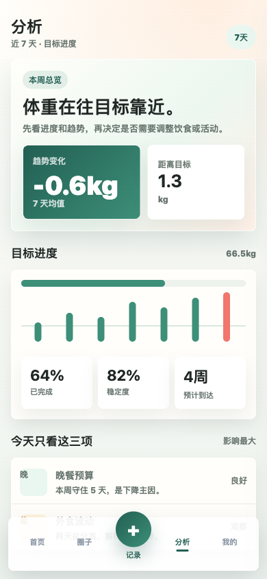
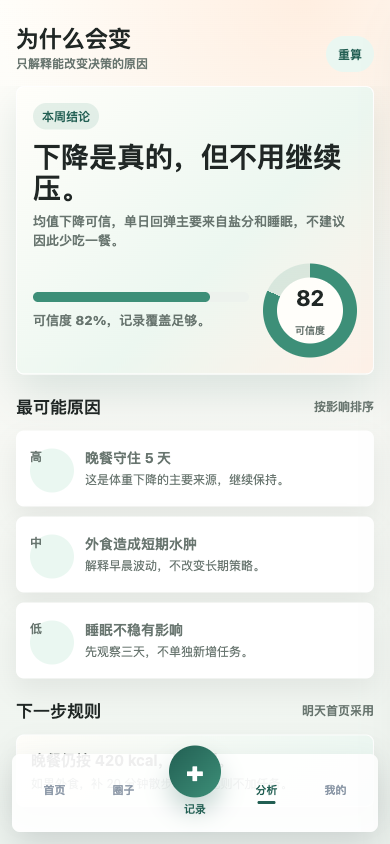
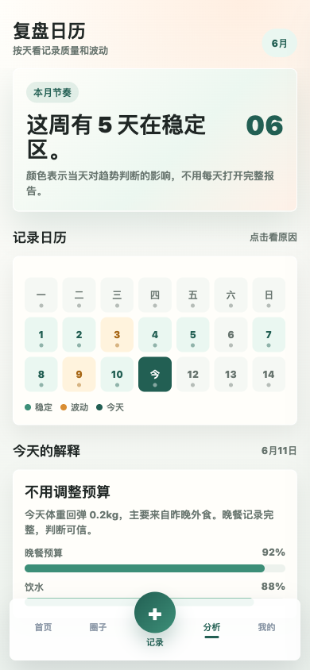
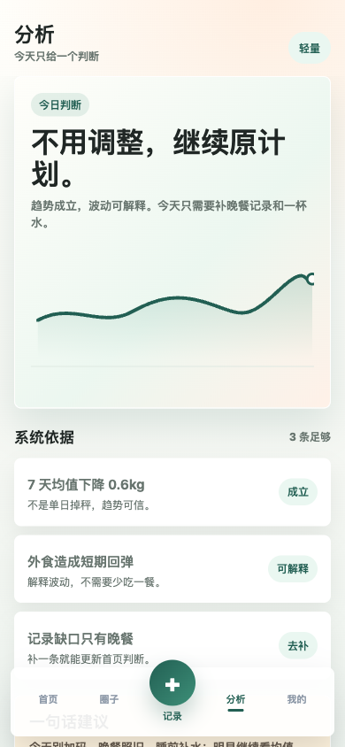
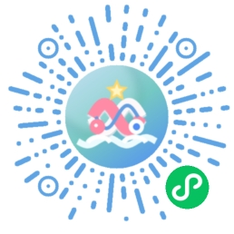

# 星绾同行

[](LICENSE) [](https://vuejs.org/) [](https://www.java.com/)

健康记录与习惯管理应用，集中记录体重、饮食、饮水、运动和日常习惯，查看历史趋势与目标进度。仓库包含 uni-app 客户端、RuoYi 管理后台、服务端接口和交互原型。

[界面预览](#界面预览) · [在线体验](#在线体验) · [快速开始](#快速开始) · [文档](#文档) · [作者作品集](http://43.156.229.191:8080/portfolio/)

> 界面原型、客户端实现与线上小程序是不同交付层次，原型图片不代表所有能力已在线上开放。本项目用于记录和回顾，不提供医学诊断或治疗建议。

## 功能

- **健康记录**：体重、饮食、饮水、运动和习惯记录。
- **趋势分析**：历史趋势、目标进度、统计摘要和阶段反馈。
- **圈子互动**：动态、评论、点赞、关注、通知和邀请。
- **反馈闭环**：建议、问题反馈、处理状态和管理端查看。
- **管理后台**：用户、菜单、数据字典、运营配置和审计能力。
- **交互原型**：提供首页、记录、分析、圈子、习惯、成就和个人中心原型页面。

## 技术栈

| 层 | 技术 |
| --- | --- |
| 移动端 | uni-app、Vue 3、TypeScript、Pinia |
| 管理端 | Vue 2、Element UI、RuoYi |
| 后端 | Java、Spring Boot、MyBatis、JWT |
| 基础设施 | MySQL、Redis、Maven |

## 界面预览

### 目标分析：趋势变化、目标进度与预计到达



### 周期复盘：习惯、记录和阶段状态



### 数据摘要：稳定性、变化和本周复盘



### 分析方案：移动端原型页面



截图来自公开演示或已脱敏的项目素材，展示功能界面与交互重点；线上版本与原型图片可能随维护变化。
## 在线体验

- [作者作品集中的星绾同行介绍](http://43.156.229.191:8080/portfolio/)
- 使用微信扫描下方小程序码体验；入口可用性和功能范围以微信内实际页面为准。
- 本地可独立查看 [交互原型](prototype/index.html)。



请在了解隐私说明后再填写数据，不要将个人健康记录提交到公开 Issue 或测试夹具。

## 快速开始

### 环境要求

Git、JDK 8+、Maven、MySQL、Redis、pnpm 和 uni-app 开发工具链。移动端基于 Vue 3，管理端仍是 Vue 2；两端依赖应分别安装，具体 Node 兼容性以各自依赖为准。

### 1. 获取代码

```bash
git clone https://github.com/WuZhaohui1993/weight-challenge-public.git
cd weight-challenge-public
```

### 2. 先预览交互原型

无需连接后端即可查看仓库内的 HTML 原型：

```bash
python3 -m http.server 5174 --directory prototype
```

打开 `http://127.0.0.1:5174/`。原型用于查看交互设计，不读写真实账号和健康记录。

### 3. 准备后端与管理端

```bash
cp -n backend/config/application-local.example.yml backend/config/application-local.yml
```

编辑被 Git 忽略的本地配置，补齐 MySQL、Redis、可选微信配置，并在启动环境中设置 `TOKEN_SECRET`。先按 [基础 SQL](backend/sql) 与 [健康业务 SQL](backend/ruoyi-weight/sql) 核对专用测试库，结合代码版本确定初始化和增量顺序，不要将所有 SQL 无差别执行到已有数据库。

```bash
mvn -f backend/pom.xml -DskipTests package
java -jar backend/ruoyi-admin/target/ruoyi-admin.jar
```

另开终端，从仓库根目录启动管理端：

```bash
cd backend/ruoyi-ui
npm install
npm run dev
```

### 4. 启动移动端

```bash
cd mobile
pnpm install
pnpm run dev:h5
```

通过本地环境变量 `VITE_API_BASE_URL` 配置后端地址；开发模式未设置时回退到 `http://127.0.0.1:8080`。微信小程序使用 `pnpm run build:mp-weixin` 构建后导入微信开发者工具，AppID、合法域名和登录配置由使用者补齐。小程序端的 `127.0.0.1` 不代表你的服务器。

## 测试

安装依赖并准备好上述配置后，在仓库根目录执行：

```bash
mvn -f backend/pom.xml test
mvn -f backend/pom.xml -DskipTests package
pnpm --dir mobile run type-check
pnpm --dir mobile run build:h5
npm --prefix backend/ruoyi-ui run build:prod
git diff --check
```

后端回归需要专用数据库、Redis 和测试账号；微信登录、真机相机/上传及消息能力需要微信开发者工具和实际设备验证。H5 构建通过不能代替小程序真机验收。 `-DskipTests package` 仅表示跳过测试打包，不表示测试通过。

## 文档

- [文档入口](docs/README.md)
- [本地配置示例](backend/config/application-local.example.yml)
- [交互原型](prototype/index.html)
- [移动端请求配置](mobile/src/utils/request.ts)
- [基础数据库脚本](backend/sql)
- [健康业务数据库脚本](backend/ruoyi-weight/sql)
- [参与贡献](CONTRIBUTING.md)
- [安全说明](SECURITY.md)
- [第三方依赖与版权](THIRD_PARTY_NOTICES.md)

## 项目结构

```text
├── mobile/                 # uni-app / Vue 3 客户端
├── prototype/              # 独立 HTML 交互原型
├── backend/
│   ├── ruoyi-admin/        # Spring Boot 启动模块
│   ├── ruoyi-api/          # 移动端接口
│   ├── ruoyi-weight/       # 健康与社区业务
│   └── ruoyi-ui/           # Vue 2 管理端
└── docs/                   # 文档与 README 图片
```

## 作者与作品集

- [GitHub · WuZhaohui1993](https://github.com/WuZhaohui1993)
- [个人作品集](http://43.156.229.191:8080/portfolio/)
- [问题反馈与功能建议](https://github.com/WuZhaohui1993/weight-challenge-public/issues)

欢迎交流使用问题、反馈 Bug 或提出功能建议；项目合作可通过作品集中的联系方式沟通。

## 安全边界

健康记录、联系方式和上传图片应按用户授权隔离存储；微信 AppSecret、Token 和数据库密钥由本地配置或部署环境管理。生产部署需完善隐私说明、数据删除、备份恢复与访问审计。 更多说明见 [SECURITY.md](SECURITY.md)。

## 参与贡献

请先阅读 [贡献指南](CONTRIBUTING.md)，保持接口、权限、配置和文档同步。反馈问题时附上复现步骤、期望结果和必要截图；提交 PR 时说明实际执行的检查及未覆盖范围，不提交真实业务数据、私有凭据或构建产物。

## 许可证

本项目自有代码采用 [MIT License](LICENSE)。第三方组件、上游代码及厂商 SDK 遵循各自许可证；版权与再分发说明见 [THIRD_PARTY_NOTICES.md](THIRD_PARTY_NOTICES.md)。
